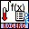

In this repo I present my most used VI packages that I have created. I use them in all my projects.

**<u>More packages coming soon !!!</u>**

# Packages
Here is a list of available and usefull LabVIEW libraries that can be installed with the VI Package Manager from JKI

 - rogerg_lib_rogerg_frontpanel_setup   :     This VI package helps to program the front panel. Open and Close. Set the Origin. Set and arrange the scrollbars.

 - rogerg_lib_rogerg_calculations	:		A collection of mathematical VIs

 - rogerg_lib_rogerg_user_interface_dialogs		:	A collection of user interface popup windows

# Contributing
Contributions are welcome! Please open an issue or a pull request to suggest changes.

# License
This project is licensed under the MIT License.

# Contact
For questions or suggestions, please contact rogergdot@gmail.com or open an issue.
